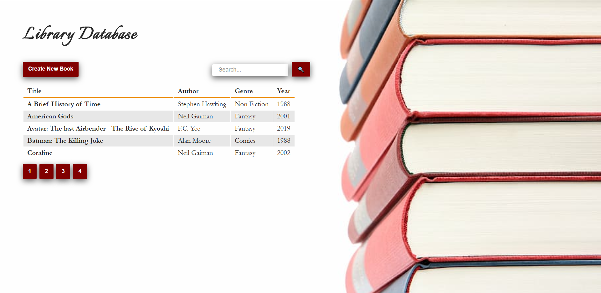
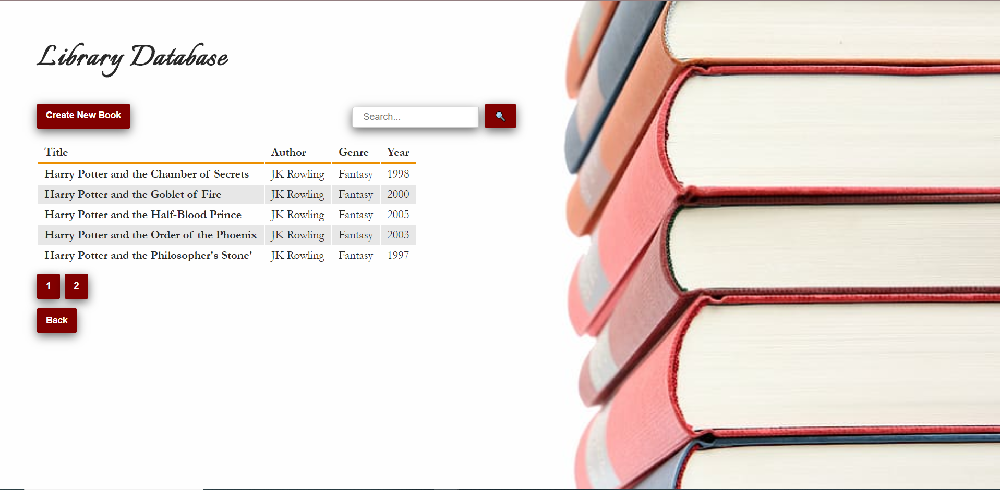
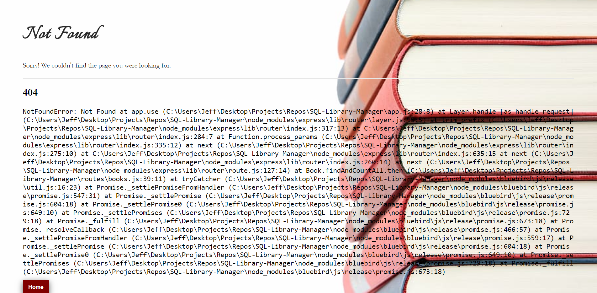
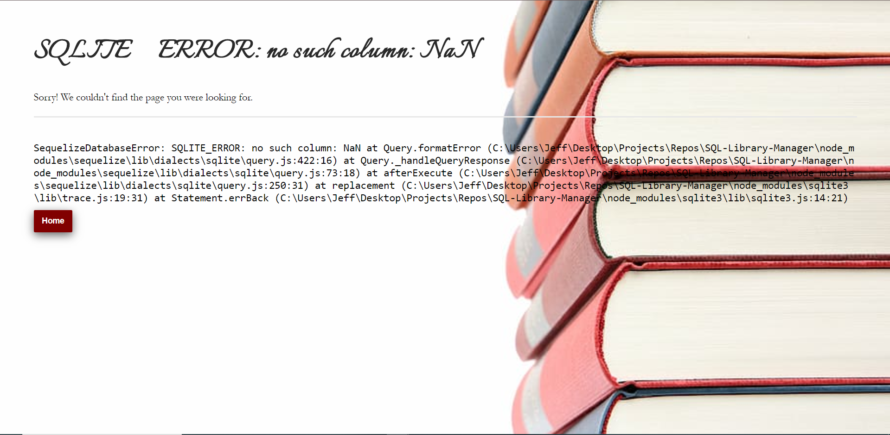
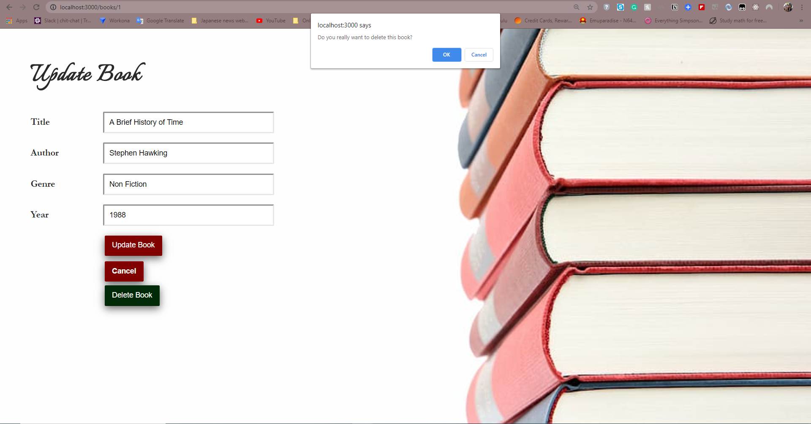

# SQL-Library-Manager

## Installation

In the projects root directory you can run:

### `npm install`

This will download all the necessary dependencies to run the project.

---

Then:

### `npm start` OR `nodemon`

---

# Explanation

This project is a mock library database application. It uses one of the most popular databases(SQLite) to store data. Additionally, this app uses Node.JS and Sequelize to perform CRUD(Create, Read, Update, and Delete) operations that allow a user to update the database with new or existing information as well as delete information.

For a live demo if this project, go to this link: COMING SOON

## Motivation

---

The motivation of this project is to highlight my working knowledge of React, communicating with web servers using their API(in this case Flickr), and how to set up routing while using the React Framework

The motivation for this project is to showcase my knowledge of working with databases using an ORM(Object-Relational Mapping) library like Sequelize as well as understanding the fundamentals of how to perform CRUD operations to the database by passing data through Node.JS routes.

This project taught me how to:

- Create a SQLite database
- Interact with the database indirectly using an ORM like Sequelize
- Creating routes with Node.js
- Perform CRUD operations by passing data through Node.js routes
- Creating complex template layouts with Pug.js
- Paginate results in a database to separate pages
- Seed a database with starter data
- Implement a search feature to look up items in a database and then paginate the results

## Technology Used

---

This project uses the following technologies:

- SQLite(https://www.sqlite.org/index.html)
- Sequelize ORM(https://sequelize.org/)
- Node.js(https://nodejs.org/en/)
- JavaScript
- CSS

## Features

---

1. Users can create, read, update, and delete items in the database
2. Search feature that fetches items related to the users search(the user can search for title, author, genre, and year)
3. Error handling for 500 and 404 error statuses
4. Paginated results. This make the data more organized and readable instead of just one long list.

## Code Example

---

### Create Route Example

- The app gets the new book route so the user can input information about a new book to add to the database
- After the data is input, the post route adds the data to the database

```javaScript

/* Create a new book form. */
router.get('/new', (req, res) => {
  res.render('books/new-book', { book: {}, title: 'New Book' });
});

/* POST create book. */
router.post(
  '/',
  asyncHandler(async (req, res) => {
    let book;

    try {
      book = await Book.create(req.body);

      res.redirect(`/books/${book.id}`);
    } catch (error) {
      if (error.name === 'SequelizeValidationError') {
        // return unsaved model instance
        book = await Book.build(req.body);
        res.render('books/new-book', {
          book,
          errors: error.errors,
          title: 'New Book',
        });
      } else {
        throw error;
      }
    }
  })
);
```

### Read Route Example

- This example go to a specific route where the books information is stored.

```javaScript

/* GET individual book. */
router.get(
  '/:id',
  asyncHandler(async (req, res, next) => {
    const book = await Book.findByPk(req.params.id);
    if (book) {
      res.render('books/update-book', { book, title: 'Update Book' });
    } else {
      next();
    }
  })
);

```

### Update Route Example

- This route posts any information that was updated about the specific route then reroutes back to the update page
- Additional error handling for required data that cannot be left out

```javaScript
/* Update book. */
router.post(
  '/:id',
  asyncHandler(async (req, res, next) => {
    let book;
    try {
      // get book from database based on params.id
      book = await Book.findByPk(req.params.id);
      // update the book info by passing in the new req.body data
      if (book) {
        await book.update(req.body);
        // redirect to the updated book page
        res.redirect(`/books/${book.id}`);
      } else {
        next();
      }
    } catch (error) {
      if (error.name === 'SequelizeValidationError') {
        book = await Book.build(req.body);
        book.id = req.params.id; // make sure correct book gets updated
        res.render('books/update-book', {
          book,
          errors: error.errors,
          title: book.title,
        });
      } else {
        throw error;
      }
    }
  })
);

```

# Delete Route Example

- This route deletes a specific book from the database and the redirects back to the home page

```javaScript
/* Delete individual book. */
router.post(
  '/:id/delete',
  asyncHandler(async (req, res, next) => {
    const book = await Book.findByPk(req.params.id);
    if (book) {
      // delete book
      await book.destroy();
      res.redirect('/books/?page=1');
    } else {
      next();
    }
  })
);
```

## Screenshots

## 

## 

## 

## 

## 

## 

## 

## 

## 

## Style Changes

---

The following style changes to the original Treehouse project are as noted:

1. CSS to make look a little better on smaller screens
2. Color palette changed
3. Font changed for Header of each page

## License

---

MIT © Jamie Gobeille 2020

```

```
